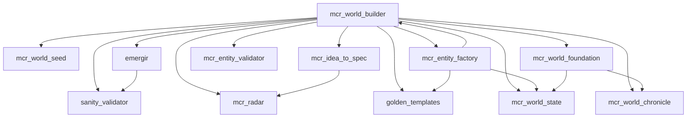

# Panorama Completo do Ecossistema MCR-DevIA
## Análise do Arquiteto — Julho 2026

---

## 1. Filosofia Central

O MCR é regido por **um único princípio**: tudo é uma transição Markov entre dois estados consecutivos, independentemente da abstração. A Equação MCR (`PONTE_OTIMA`) é o coração matemático do sistema, e a **entropia** é a métrica universal que guia todas as decisões.

### 1.1 A Equação MCR (PONTE_OTIMA)

Definida em `mcr/equacao_mcr.py` e `mcr/mcr_meta.py`:

```
PONTE_OTIMA = (5 × DIVERGÊNCIA + 3 × ESPECIFICIDADE + 2 × PROFUNDIDADE) / 10
```

Onde:
- **Divergência** (peso 5): variedade de API calls do padrão — quantas APIs diferentes ele usa.
- **Especificidade** (peso 3): variedade de variáveis do padrão — quão específico é o vocabulário.
- **Profundidade** (peso 2): tamanho do arquivo em linhas normalizado.

**Cálculo real** (`mcr/equacao_mcr.py:calcular_ponte`):
```python
score = (divergencia * w_div + especificidade * w_esp + profundidade * w_prof) / 10.0
return min(1.0, max(0.0, score))
```

### 1.2 A Fórmula Geral

`mcr/equacao_mcr.py` — 15 parâmetros calibrados evolutivamente:

```python
_EQUACAO_ATUAL = {
    'formula': '2*by + 1*pa',
    'peso_byte': 1, 'peso_palavra': 13, 'peso_token': 1,
    'penalidade_compartilhado': 0.0, 'penalidade_parcial': 0.3,
    'penalidade_byte': 0.7, 'penalidade_none': 0.9,
    'ponte_divergencia': 2, 'ponte_especificidade': 3, 'ponte_profundidade': 2,
    'threshold_conteudo': 0.6, 'threshold_parcial': 0.3,
    'conf_min_base': 0.1, 'passos_base': 6,
}
```

8 fórmulas disponíveis: `by + pa + tk`, `by * pa + tk`, `max(by, pa, tk)`, etc.

### 1.3 A Entropia como Métrica Universal

No `devia/kernel/MCR.py`, a entropia de Shannon (bits) é calculada para qualquer estado Markov:

```python
def entropia(self, a) -> float:
    h = 0.0
    for c in prox.values():
        p = c/t
        if p > 0: h -= p * math.log2(p)
    return h
```

Usada para:
- **Autoavaliação**: baixa entropia = mais coerente
- **Decisão**: `MCRSystem._decidir()` usa entropia + confiança para escolher ação
- **Auto-Evolução**: `MCRAutoEvolution.ciclo()` — aceita mutação se entropia global diminui
- **Criticalidade**: entropia 0.2–0.7 = borda do caos (ponto ideal para aprendizado)
- **Superposição**: colisão de duas cadeias Markov → emergência (novos tokens)

---

## 2. Arquitetura de Alto Nível

```
                      ┌──────────────────────┐
                      │     HUMANO/USUÁRIO    │
                      └──────┬───────┬───────┘
                             │       │
              ┌──────────────┘       └──────────────┐
              ▼                                      ▼
   ┌──────────────────┐                  ┌─────────────────────┐
   │  start_mcr_organism│                 │   mcr_devia.py      │
   │  (Power On)       │                 │   (Entry Point)     │
   └──────────────────┘                  └─────────────────────┘
                            │
              ┌───────────────┼──────────────────┐
              ▼               ▼                  ▼
   ┌──────────────────┐ ┌──────────┐ ┌─────────────────┐
   │ MasterAgent      │ │MarkovR. │ │PipelineExecutor │
   │ PERCEBER→PLANEJAR│ │Decide    │ │cmd_grep→read→   │
   │ →EXECUTAR→       │ │sequência │ │llm_gerar→write  │
   │ →INTEGRAR→       │ │de ações  │ │                 │
   │ →APRENDER        │ └──────────┘ └─────────────────┘
   └──────────────────┘
            │
           ┌┼────────────────┐
           ▼▼                ▼
   ┌──────────────┐ ┌──────────────┐
   │  LLM (Ollama)│ │ MCR.py      │
   │  qwen/mistral│ │ ~7070 linhas │
   │  :11434      │ │ 47 classes   │
   └──────────────┘ └──────────────┘
```

### 2.1 Três Pilares de Processamento

| Pilar | Engine | Quando | GPU |
|-------|--------|--------|-----|
| **S1 — Markov Puro** | `MCR.py` (stdlib, zero deps) | Tudo que não precisa de LLM | 0% |
| **S2 — LLM** | Ollama (qwen/mistral) | Geração de código, lore, crônica | 100% |
| **S3 — Knowledge Graph** | `devia/knowledge/patterns_*.json` | Memória de 2.690 padrões | 0% |

### 2.2 Serviços de Rede

| Serviço | Porta | Protocolo | Função |
|---------|-------|-----------|--------|
| NPC Server | 7777 | Socket TCP | Diálogo NPC em tempo real |
| Bridge API | 7778 | HTTP REST | Ponte Grimório C# → Python |
| Ollama | 11434 | HTTP | LLM local |

---

## 3. Submódulos e Responsabilidades

### 3.1 Infraestrutura Base (`mcr/`)

| Módulo | Funções Exportadas | Responsabilidade |
|--------|-------------------|-----------------|
| `paths.py` | `ROOT_DIR`, `CANARY_NPC_DIR`, `KG_DIR` (27 constantes) | Centralizar TODOS os caminhos |
| `encoding.py` | `read_file()`, `write_file()`, `read_lines()`, `write_lines()` | Encoding por extensão (.lua=Latin-1, resto=UTF-8) |

### 3.2 Núcleo Markov (`devia/kernel/MCR.py` — 7.072 linhas)

**Classe fundamental: `MCR`** (linha 46)
- `aprender(a, b)` → registra transição Markov
- `predizer(a)` → `(proximo_token, confianca)` via argmax
- `entropia(a)` → entropia de Shannon de um estado
- `gerar(semente, passos)` → gera sequência

**6+ níveis registrados:** byte, palavra, token, decisao, threshold, assinatura, qualidade, filosofia

**47 classes no total:**

| Classe | Linha | Função |
|--------|-------|--------|
| `MCR` | 46 | Núcleo Markov |
| `MCRSystem` | 557 | Orquestrador de alto nível |
| `MCRPergunta` | 1943 | Responder perguntas via Markov puro |
| `MCREntropia` | 2391 | Detecção de loops por entropia |
| `MCRDecisor` | 2459 | Decisor Markov (sem if/else) |
| `MCRThreshold` | 3408 | Limiares auto-ajustáveis |
| `MCRFuel` | 3504 | Combustível do sistema |
| `MCRMeta` | 2860 | Auto-avaliação e diagnóstico |
| `MCRSignature` | 5258 | Assinatura multidimensional |
| `MCRBufferKG` | 4320 | KG interno (fallback) |
| `MCRConector` | 1462 | Ponte entre cadeias Markov |
| `MCRCadeia` | 1741 | Geração de cadeia completa |
| `MCRPesoNota` | 3332 | Descoberta de pesos ótimos |

### 3.3 Pipeline de Mundo (`mcr/mcr_world_builder.py` — 1.265 linhas)

| Função | Assinatura | Descrição |
|--------|-----------|-----------|
| `gerar_lore_com_feedback(tema)` | `str -> str` | Mistral + loop de gap de conceitos |
| `extrair_entidades(lore)` | `str -> Dict` | Regex + LLM estruturado |
| `arquitetar_mundo(entidades, tema)` | `(Dict, str) -> list` | Detecção de tema comercial |
| `planejar_contexto(tarefa, lore)` | `(Dict, str) -> str` | Dossiê focado |
| `codificar(tarefa, dossie)` | `(Dict, str) -> dict` | Qwen + golden examples + validação dupla |
| `_carregar_padroes(tipo, max, papel)` | `(str, int, str) -> str` | 3 níveis: KG semântico → Radar → aleatório |
| `_filtrar_estrutura_exemplo(codigo, tipo)` | `(str, str) -> str` | Remove callbacks, 800 chars |
| `construir_mundo(tema, modo, min)` | `(str, str, dict) -> dict` | Pipeline completo (2 modos) |
| `expandir_npc(nome, instrucao)` | `(str, str) -> dict` | Injeção cirúrgica + auto-npcHandler |
| `expandir_mundo(tema, quantidade)` | `(str, int) -> dict` | Pipeline iterativo completo |

### 3.4 Fundação e Estado do Mundo

| Módulo | Funções Chave |
|--------|--------------|
| `mcr_world_seed.py` | `generate_world_seed_lite(tema)` — Mistral → world_name, conflict, concepts |
| `mcr_world_foundation.py` | `generate_world_seed(theme, min)`, `validate_foundation(seed)` + 6 camadas, `world_event(...)` — altera seed + crônica |
| `mcr_world_state.py` | `registrar_entidade()`, `obter_entidade()`, `salvar_foundation()`, `carregar_foundation()` |
| `mcr_world_chronicle.py` | `generate_chronicle(seed)` — Mistral épico, `append_chronicle(text, meta)`, `get_chronicle(n)` |

### 3.5 Inteligência e Validação

| Módulo | Função Principal |
|--------|-----------------|
| `metacognicao.py` | `Metacognicao.avaliar_pedido(prompt)` — Gateway de Incerteza, threshold 70% |
| `sanity_validator.py` | `SanityValidator(codigo)` — Tree-sitter extrai chamadas → 517 APIs |
| `anti_pattern.py` | `classificar_erro()`, `registrar_anti_pattern()` — classifica erros Lua |
| `shadow_canary.py` | `executar_shadow_test(path)` — Mock LuaJIT + auto anti-pattern |
| `LuaSyntaxValidator.py` (devia/) | `verificar_sintaxe(codigo)` — sandbox loadstring + regex |
| `mcr_entity_validator.py` | `validate_entity(spec, state, pending)` — nome único + giver + coerência |

### 3.6 Criatividade e Geração

| Módulo | Função |
|--------|--------|
| `emergir.py` | `Emergir.gerar_ideia()`, `executar_ideia()`, `gerar_ideias_tematicas(conceitos, n)` |
| `golden_templates.py` | `gerar_npc_canary(params)` — zero LLM, `is_template_role(role)`, `ROLE_TEMPLATE_MAP` |
| `mcr_idea_to_spec.py` | `idea_to_entity_spec(ideia, tema, golden)` — Qwen → JSON spec |
| `mcr_entity_factory.py` | `create_entity(spec, state)` — 3 tiers (template/codificado/quest) |
| `mcr_radar.py` | `RadarMCR.buscar(consulta, candidatos, fn_sim)` — 4 ondas (70/50/30/10%) |
| `mcr_orchestrator.py` | `escolher_ferramenta(pergunta)`, `rotear(pergunta)` — Jaccard + equação MCR |

### 3.7 Fases Avançadas

| Fase | Módulos | Descrição |
|------|---------|-----------|
| FASE 1 | `pattern_miner.py` | Tree-sitter → 2.694 padrões |
| FASE 2 | `metacognicao.py` | Gateway de Incerteza |
| FASE 3 | `meta_gap.py`, `auto_curiosidade.py` | Detector de lacunas + thread |
| FASE 4 | `anti_pattern.py`, `anti_pattern_injector.py`, `logwatcher_bridge.py` | Loop de aprendizado |
| FASE 5 | `shadow_canary.py` | Mock LuaJIT |
| FASE 6 | `emergir.py`, `sanity_validator.py` | Motor de criatividade |
| FASE 7 | `npc_server.py`, `npc_sanity_filter.py`, `dialogue_miner.py`, `dialogue_trainer.py` | NPC Server :7777 |
| FASE 8 | `mcr_self.py`, `mcr_autobiography.py`, `mcr_inner_voice.py`, `mcr_conversa.py` | Consciência |

---

## 4. Fluxos de Dados

### 4.1 Pipeline Padrão (`construir_mundo modo="padrao"`)
```
Tema → gerar_lore_com_feedback (Mistral + loop gap)
     → extrair_entidades (regex + LLM)
     → arquitetar_mundo (detecta tema)
     → Para cada tarefa:
         planejar_contexto
         → codificar:
             _carregar_padroes (KG → Radar → aleatório)
             LLM Qwen
             LuaValidator + SanityValidator
             salvar .lua
     → Relatório
```

### 4.2 Pipeline Iterativo (`expandir_mundo`)
```
Tema → generate_world_seed_lite (Mistral → concepts)
     → Emergir.gerar_ideias_tematicas (combina conceitos)
     → Para cada ideia:
         idea_to_entity_spec (Qwen + golden example)
         validate_entity (nome único + coerência)
         create_entity (Tier 1/2/3)
     → What If 2º nível (Mistral → expandir_npc)
     → Crônica final
```

### 4.3 Injeção Cirúrgica (`expandir_npc`)
```
nome + instrução → ler .lua
                 → LLM Qwen gera bloco
                 → Auto-npcHandler se necessário
                 → Auto-assinatura callback
                 → Injetar antes de npcType:register
                 → Loop validação (3x):
                     LuaValidator + SanityValidator + _validar_logica_expansao
                 → Salvar + world_state
```

---

## 5. Métricas de Performance

| Operação | Tempo | GPU |
|----------|-------|-----|
| Pergunta conceitual (KG) | 0.007s | 0% |
| Diálogo NPC | <0.001s | 0% |
| Geração NPC Tier 1 (template) | <0.001s | 0% |
| Geração NPC Tier 2 (codificar) | ~5-10s | 100% |
| Injeção de quest (expandir_npc) | ~5-15s | 100% |
| Pipeline iterativo (10 entidades) | ~174s | 100% |
| Validação Lua | <0.1s | 0% |
| Mineração AST 2.690 arquivos | ~2s | 0% |
| Busca Radar (4 ondas) | <0.1s | 0% |

---

## 6. Configurações

| Parâmetro | Valor | Local |
|-----------|-------|-------|
| LLM código | `qwen2.5-coder:7b` | `MODELO_CODIGO` |
| LLM lore/chat | `mistral:7b` | `MODELO_LORE` |
| Host Ollama | `localhost:11434` | `OLLAMA_CHAT` |
| Timeout código | 180s | `_gerar_codigo_llm` |
| Timeout lore | 60s-120s | `_chamar_llm` |
| Max tokens código | 1000 (800 p/ bloco) | `_gerar_codigo_llm` |
| Max tokens lore | 600-1500 | `_chamar_llm` |
| Max tokens seed | 2000 | `_call_llm` |
| Temperatura código | 0.4 | payload |
| Temperatura lore | 0.7-0.8 | payload |
| Seed retries | 3 | `generate_world_seed` |
| Injeção retries | 3 | `expandir_npc` |
| Golden example max | 800 chars | `_filtrar_estrutura_exemplo` |
| NPC filter trunc | 800 chars sem callbacks | `_filtrar_estrutura_exemplo` |

---

## 7. Diretórios Críticos

| Path | Conteúdo | Constante |
|------|----------|-----------|
| `E:\MCR\mcr\` | 35 módulos Python | - |
| `E:\MCR\devia\knowledge\` | KG: 2.690 patterns em `patterns_*.json` | `KG_DIR` |
| `E:\MCR\devia\world_state.json` | Estado do Mundo (NPCs, monstros, fundação) | `WORLD_STATE_FILE` |
| `E:\MCR\devia\world_chronicle.md` | Crônica narrativa | `CHRONICLE_FILE` |
| `E:\MCR\server\data-otservbr-global\npc\` | 1.034+ NPCs .lua | `CANARY_NPC_DIR` |
| `E:\MCR\server\data-otservbr-global\monster\` | 1.656+ monstros .lua | `CANARY_MONSTER_DIR` |
| `E:\MCR\golden_examples\` | Templates zero-LLM | `GOLDEN_EXAMPLES_DIR` |
| `E:\MCR\sandbox_criativo\` | Ideias não validadas | `SANDBOX_CRIATIVO_DIR` |
| `E:\MCR\ideas_que_funcionaram\` | Ideias validadas | `IDEAS_DIR` |
| `E:\MCR\cache\` | Cache L1/L2/RAG | `CACHE_DIR` |

---

## 8. Observações do Arquiteto

### 8.1 Equação MCR subutilizada no novo pipeline
A `PONTE_OTIMA` é usada pelo `MCRMeta` para diagnosticar o KG, mas **não** no pipeline iterativo. Decisões de "qual ideia gerar" ou "qual golden example escolher" não passam pela equação.

### 8.2 Radar com 4 ondas, só 2 usadas
`_carregar_padroes()` usa nível 1 (dicionário semântico) e nível 2 (Radar fingerprint). As ondas internas do Radar (exata 70%, contextual 10%) não são expostas diretamente.

### 8.3 World State vs World Chronicle: overlap
`world_state.json` armazena estrutura; `world_chronicle.md` armazena narrativa append-only. Ambos são modificados por `world_event()`. Sem índice no chronicle, `get_chronicle(n)` faz parsing linear de arquivo crescente.

### 8.4 Nenhum cache de LLM
Toda chamada ao LLM é fresh. 10 entidades = ~16 chamadas. 50 entidades = ~80 chamadas. Tempo escala linearmente.

### 8.5 Dependências entre módulos


---

*Gerado em 2026-07-08 pelo Arquiteto (DeepSeek R1) via análise completa do código-fonte.*
